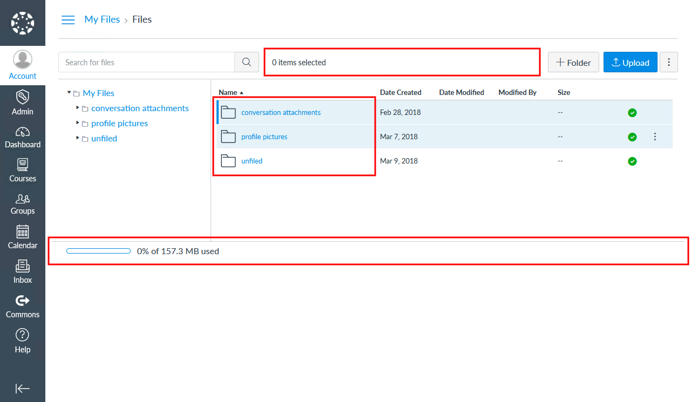
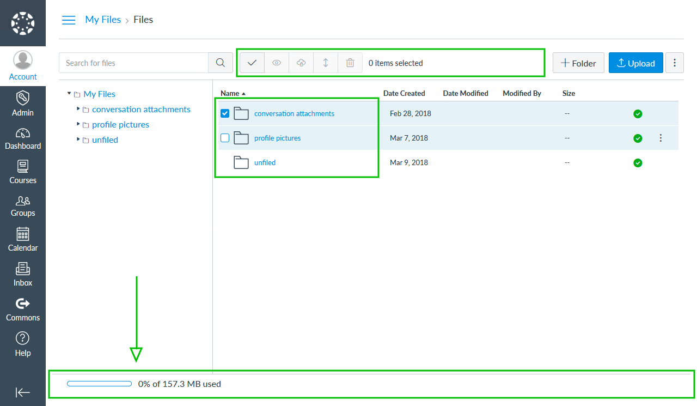

# File Explorer Enhancements Plug-in

[](https://www.npmjs.com/package/@artevelde-uas/canvas-lms-file-explorer-enhancements-plugin)
[](https://spdx.org/licenses/ISC)
[](https://www.npmjs.com/package/@artevelde-uas/canvas-lms-file-explorer-enhancements-plugin)

Plug-in for the [Canvas LMS theme app](https://github.com/artevelde-uas/canvas-lms-app) that adds some enhancements to the file explorer.

## Features

* Always shows the action bar
* Adds a 'select all' button to the action bar
* Changes the row selection to a more intuitive style with select boxes (like Windows Explorer)
* Moves the status bar down so you have the full height of the window at your disposal

#### Before



#### After



## Installation

Using NPM:

    npm install @artevelde-uas/canvas-lms-file-explorer-enhancements-plugin

Using Yarn:

    yarn add @artevelde-uas/canvas-lms-file-explorer-enhancements-plugin

## Usage

Just import the plug-in and add it to the Canvas app:

```javascript
import { run, addPlugin } from '@artevelde-uas/canvas-lms-app';
import fileExplorerEnhancementsPlugin from '@artevelde-uas/canvas-lms-file-explorer-enhancements-plugin';

addPlugin(fileExplorerEnhancementsPlugin);

run();
```
